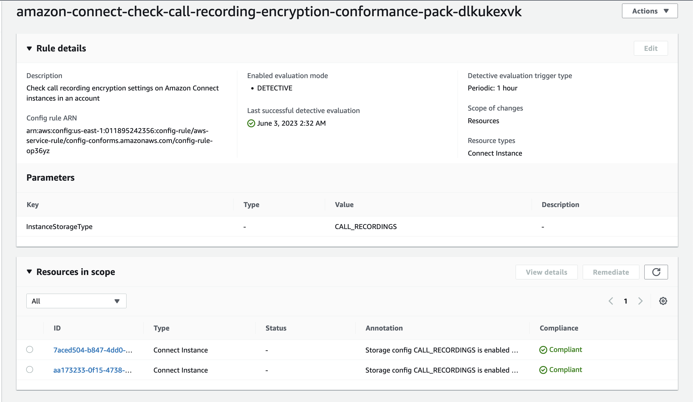

# Amazon Connect Config Rules

The Amazon Connect Config Rules project contains an example of an [AWS Config Conformance Pack](https://docs.aws.amazon.com/config/latest/developerguide/conformance-packs.html) with rules for [Amazon Connect](https://aws.amazon.com/connect/) contact center instances.

This repository was presented as a demo for BIZ302, "Meet your company’s security and compliance needs with Amazon Connect" at [AWS DC Summit 2023](https://aws.amazon.com/events/summits/washington-dc/). Contained at the bottom of this repository are links to resources on Amazon Connect compliance.

**What is AWS Config?**

[AWS Config](https://aws.amazon.com/config/) is a fully managed service that provides you with resource inventory, configuration history, and configuration change notifications for AWS resources. With AWS Config, you can discover existing AWS resources, record configurations, export a complete inventory of your resources with all configuration details, and determine how a resource was configured at any point in time. 

These capabilities use compliance auditing, security analysis, resource change tracking, and troubleshooting.
Show less

**What is an AWS Config rule?**

An AWS Config rule represents desired configurations for a resource and is evaluated against configuration changes on the relevant resources, as recorded by AWS Config. The results of evaluating a rule against the configuration of a resource are available on a dashboard. 

Using AWS Config rules, you can assess your overall compliance and risk status from a configuration perspective, view compliance trends over time, and pinpoint which configuration change caused a resource to drift out of compliance with a rule.

**What is a conformance pack?**

A conformance pack is a collection of AWS Config rules and remediation actions that is built using a common framework and packaging model on AWS Config. By packaging the preceding AWS Config artifacts, you can simplify the deployment and reporting aspects of governance policies and configuration compliance across multiple accounts and Regions and reduce the time that a resource is kept in a non-compliant state.

## Deployment
1. Clone the repository, or download the [amazon-connect-config-rules.yml](amazon-connect-config-rules.yml) CloudFormation template to your computer.
2. Navigate to the AWS CloudFormation console.
3. Choose **Create stack, with new resources (standard)**.
4. Choose **Upload a template file**. Select the above CloudFormation template from the repository.
5. For Stack name, enter something descriptive, such as `amazon-connect-config-rules`.
6. Choose **Next**.
8. On the Configure stack options page, choose **Next**.
7. Select **I acknowledge that AWS CloudFormation might create IAM resources with custom names**.
8. Choose **Create stack**.

After the CloudFormation template has deployed, you can access the Conformance Pack and corresponding rules through the AWS Config console.

## What did I just deploy?
The rules contained here are meant to provide examples of how you can use AWS Config to automate security and compliance checks on your contact center instances. For example, a rule was deployed to ensure that if your Amazon Connect instance has Call Recording enabled, you are using AWS KMS encryption keys. The rule will mark resources (Amazon Connect instances) **Compliant** if this is true, **Not Compliant** if there is no encryption, or **Not Applicable** if call recording is disabled.

## What next?
AWS Config Custom Rules can be designed to check additional configurations made on your Amazon Connect instance. For example, you may want to continuously audit security profies, phone number configurations, etc. Additional conformancee packs can be deployed to provide starting points on operational best practices for common compliance frameworks like HIPAA, PCI, and FedRAMP.

While this conformance pack is not designed to ensure compliance by itself, you can use patterns laid out here to identify non-compliant and automatically remediate issues as defined by your organization.

## How can I contribute?
If you have examples of AWS Config rules for Amazon Connect instances, feel free to open a PR with your suggestions and contributions!

## Additional Resources
* [Amazon Connect Docs: Best practices for PII compliance in Amazon Connect](https://docs.aws.amazon.com/connect/latest/adminguide/compliance-validation-best-practices-PII.html)
* [Creating a Secure IVR solution with Amazon Connect blog](https://aws.amazon.com/blogs/contact-center/creating-a-secure-ivr-solution-with-amazon-connect/)
* [Amazon Connect achieves FedRAMP High authorization](https://aws.amazon.com/blogs/publicsector/amazon-connect-achieves-fedramp-high-authorization/)
* [AWS Services in Scope by Compliance Program page](https://aws.amazon.com/compliance/services-in-scope/)

## Security

See [CONTRIBUTING](CONTRIBUTING.md#security-issue-notifications) for more information.

## License

This library is licensed under the MIT-0 License. See the LICENSE file.

